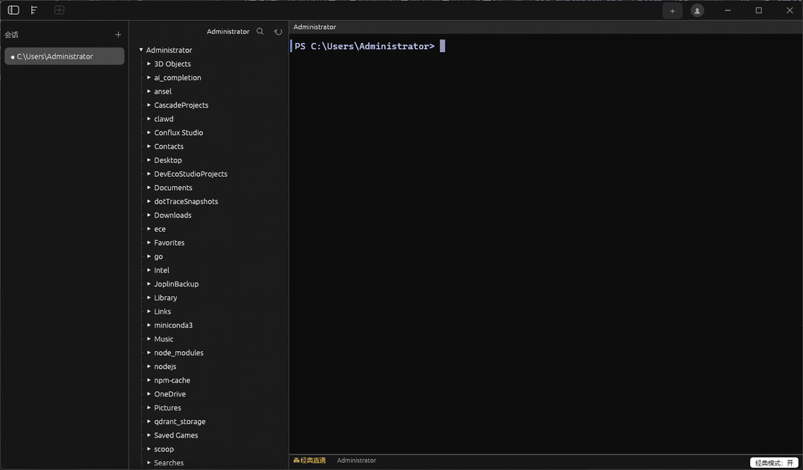

# Lumen

**一个类 Warp 的现代 GPU 加速终端** —— Rust 编写，Windows 优先。

<p align="center">
  
</p>

Lumen 把 GPU 渲染的流畅、命令块（Blocks）、现代输入编辑器、多窗格分屏、
主题皮肤与多语言界面，做进一个原生 Windows 终端里；目标是把"敲命令"这件
事，做得和现代代码编辑器一样顺手。

> 状态：终端底座 + 应用外壳 + 现代输入编辑器均已落地，正在持续打磨。

---

## ✨ 特性

### 终端核心
- **ConPTY 跑 PowerShell**：优先 `pwsh`、回退 `powershell`。
- **完整 VT100/ANSI 解析**：SGR 16/256/真彩色、光标控制、擦除、滚动区、
  备用屏幕（vim/less 等全屏程序）、bracketed paste、DEC 2026 同步更新。
- **GPU 渲染**：wgpu + glyphon 文本 + 自绘矩形管线（背景色块/光标/下划线），
  空闲零渲染、合帧限频，不空转抢 CPU。
- **10k 行回滚**：鼠标滚轮、`Shift+PgUp/PgDn` 翻屏。
- **中文 IME 输入**：预编辑内嵌、候选框跟随光标。
- **命令块（Blocks）**：通过 shell 集成的 OSC 133 采集命令边界，左缘状态条
  指示运行中（蓝）/成功（绿）/失败（红）；点击命令块可选中其输出。

### 现代输入编辑器
- **多行命令编辑**：底部独立输入区（footer），`Shift+Enter` 换行。
- **PowerShell 语法高亮**：命令/关键字/参数/变量/数字/字符串/注释/操作符
  分色，配色随当前主题自动协调。
- **续行检测**：引号/管道未闭合时回车自动换行，而非提交。
- **命令历史**：`↑/↓` 导航、放弃稿找回；首次启动自动导入 PSReadLine 历史。
- **模糊历史搜索**：`Ctrl+R` 弹出搜索面板（子序列匹配 + 频率/近因加权、
  命中高亮、退出码徽标），回车填入输入区不直接执行。
- **Tab 补全**：文件路径本地补全 + 后台 `pwsh` sidecar 命令补全。
- **Ghost text**：历史最佳前缀灰字提示，`→`/`End` 接受。
- **退出码角标**：命令结束显示 ✓/✗ 与耗时。
- **经典直通模式**：`Ctrl+Shift+E` 一键切回传统逐字节直通（走 PSReadLine）。

### 界面与外观
- **自绘标题栏**：无边框窗口，标题栏与顶栏融合（Warp/VSCode 形态），支持
  拖动、双击最大化、Win11 Snap Layouts。
- **11 个内置主题**：Lumen Dark/Light、Tokyo Night 深浅、Dracula、Nord、
  Gruvbox、Solarized 深浅、Catppuccin、One Dark；设置页主题画廊预览，
  **Sync with OS** 跟随系统深浅自动切换。
- **多语言（i18n）**：简体中文 / 繁体中文 / English，设置页即时切换 + 持久化。
- **终端背景图片**：选本地图片 + 不透明度 / 暗化滑块（保文字可读）。
- **文件树**：右键新建文件/文件夹、删除走回收站、进入文件夹（cd）、复制
  绝对/相对路径、在文件管理器中打开；拖文件到终端插入路径；顶部递归搜索。
- **可点击链接**：终端里的 URL / 文件路径（含 `:行:列`）/ OSC 8 超链接，
  hover 显示下划线与提示，`Ctrl+单击` 打开（URL→浏览器、文件→默认程序）。
- **系统提示**：右下角分级 toast（信息 / 警告 / 错误，自动消失）。

### 多窗格分屏
- 每个会话最多 **6 个窗格**，固定均分布局（1 满屏 / 2 左右 / … / 6 上3下2）。
- 窗格比例**可拖动调整**（分隔条 hover 变光标、双击恢复均分）。
- 每格独立标题栏（显示 cwd、关闭 / 最大化按钮），**拖标题栏可交换窗格位置**。
- 窗格**最大化/还原**；点击窗格聚焦，键盘/IME/文件树跟随焦点窗格。

### 会话与窗口
- **会话持久化**：左侧会话列表、各窗格 cwd / 比例 / 最大化态，重启自动还原
  （不恢复屏幕内容，重开 shell）。
- **单实例**：正式版不可多开（第二个实例把已有窗口带到前台后退出）；
  调试版或 `--multi-instance` / `LUMEN_MULTI_INSTANCE=1` 放开多开。
- **启动默认最大化**；侧栏 / 文件树栏宽度可拖动并持久化。
- **自动更新**：启动检查 GitHub 最新 Release，有新版弹提示，一键下载安装
  包并重启（可在 设置 → 关于 → 更新 中开关 / 手动检查）。

---

## 📦 构建运行

要求：**Rust 1.85+**、**Windows 10 1809+**（ConPTY）。

```powershell
# 开发运行（推荐，编译快、带控制台日志）
cargo run

# 发布构建
cargo build --release
# 产物：target\release\lumen.exe
```

可选特性 `input-editor`（现代输入编辑器）默认开启；`--no-default-features`
可整体剔除，回退为传统逐字节终端。

---

## ⌨️ 快捷键

| 快捷键 | 功能 |
|---|---|
| `Ctrl+T` | 新建会话 |
| `Ctrl+W` | 关闭当前会话 |
| `Ctrl+Tab` / `Ctrl+Shift+Tab` | 下一个 / 上一个会话 |
| `Ctrl+B` | 文件树开合 |
| `Ctrl+,` | 打开 / 关闭设置 |
| `Ctrl+↑` / `Ctrl+↓` | 命令块间跳转 |
| `Ctrl+C` | 复制选区/选中块输出；无选择时发送中断 |
| `Ctrl+V` / `Shift+Insert` | 粘贴 |
| `Shift+PgUp` / `Shift+PgDn` | 上下翻屏 |
| `Esc` | 关闭设置 / 覆盖层 |
| **分屏** | |
| `Ctrl+Shift+D` | 新增窗格 |
| `Ctrl+Shift+W` | 关闭窗格 |
| `Ctrl+Shift+Enter` | 窗格最大化 / 还原 |
| **输入编辑器** | |
| `↑` / `↓` | 命令历史导航 |
| `Ctrl+R` | 模糊历史搜索 |
| `Tab` | 补全（文件路径 / 命令） |
| `Shift+Enter` | 多行换行 |
| `Ctrl+Shift+E` | 切换经典直通模式 |
| `Ctrl+单击` | 打开终端里的链接 / 文件 |

---

## 🏗️ 架构

```
crates/
├── lumen-pty/       # PTY 抽象（portable-pty / ConPTY）
├── lumen-term/      # VT 解析 + Grid + Block 模型（纯数据，无图形依赖）
├── lumen-editor/    # 输入编辑器状态机（多行/光标/undo/语法高亮，纯逻辑）
├── lumen-renderer/  # wgpu + glyphon 渲染
└── lumen-app/       # winit 主程序 + egui 外壳（顶栏/侧栏/文件树/设置/分屏）
```

数据流：PTY 字节 → `lumen-term` 状态机 → `Grid` → `lumen-renderer` 上屏；
键盘/鼠标/IME → `lumen-app` 路由 →（编辑器态）`lumen-editor` → 提交回 PTY。

详见 [docs/架构设计.md](docs/架构设计.md) 与 [docs/输入编辑器设计.md](docs/输入编辑器设计.md)。

---

## 🗺️ 路线图

- **终端底座** ✅ ConPTY / VT 解析 / GPU 渲染 / Blocks
- **应用外壳** ✅ 自绘标题栏 / 分屏 / 主题库 / i18n / 文件树 / 背景图
- **现代输入编辑器** ✅ 多行编辑 / 语法高亮 / 历史搜索 / 补全 / 可点击链接
- **热更新** ✅ GitHub Release 自动更新
- **AI 集成** 🔭 自然语言转命令、报错解释（规划中）
- **云同步 / 远程** 🔭 登录后个人数据多设备同步、状态与操作协议（规划中）

---

## 📄 许可

[MIT](LICENSE) © jimhy
